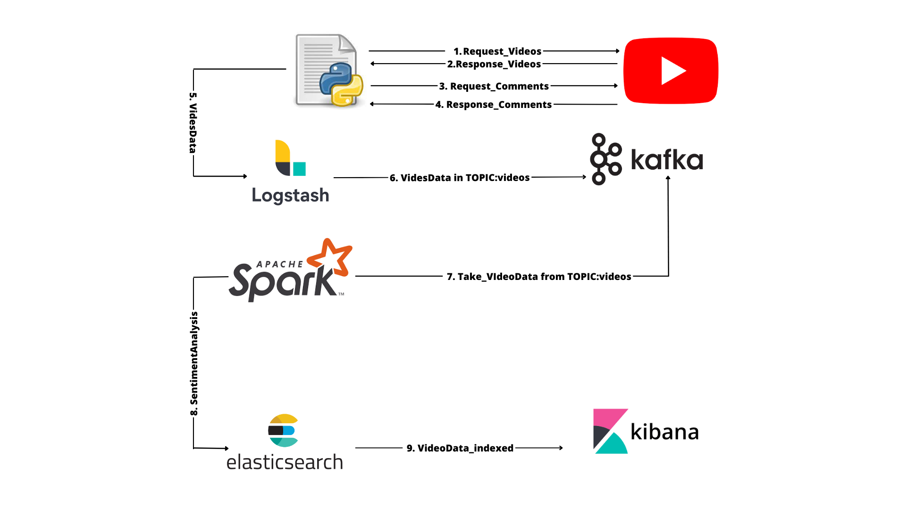

<h1> SentimenTube </h1>
 
<br>
<p> Sentiment Tube" è un progetto all'avanguardia che si propone di esplorare e comprendere il mondo dei contenuti video di YouTube attraverso l'analisi dei sentimenti espressi nei commenti degli utenti. Sfruttando una combinazione di potenti tecnologie, tra cui Logstash, Kafka, Spark, Elasticsearch e Kibana, il progetto mira a fornire una visione esaustiva del panorama emotivo associato ai video condivisi online.

Con l'obiettivo di svelare il sentimento dominante nei commenti, "Sentiment Tube" utilizza la libreria di analisi del linguaggio naturale NLTK per calcolare il polarity score, valutando se i commenti esprimono un tono positivo, negativo o neutro. Questa analisi consentirà ai creatori di contenuti, ai marketer e agli studiosi di ottenere preziose intuizioni sul coinvolgimento e l'impatto emozionale dei video su YouTube.

Attraverso il flusso di dati strutturati generato da Logstash e la gestione efficiente in streaming di Kafka, "Sentiment Tube" può gestire grandi volumi di commenti provenienti da diverse fonti, inviandoli poi a Spark per un'analisi in tempo reale. L'utilizzo di Spark garantisce un'elaborazione scalabile e rapida dei dati, aprendo la strada a una profonda comprensione dei sentimenti espressi dagli utenti.

L'integrazione di Elasticsearch e Kibana offre una visualizzazione intuitiva e interattiva dei risultati dell'analisi dei sentimenti, consentendo agli utenti di esplorare e analizzare in modo approfondito il panorama emotivo dei contenuti video di YouTube. "Sentiment Tube" si propone di diventare una preziosa risorsa per l'industria del video online, offrendo un'analisi accurata e significativa delle emozioni dei commenti degli utenti per migliorare l'esperienza complessiva di fruizione dei contenuti video. 
</p>

<h2> Pipeline SentimenTube </h2>
 

<h2> Avvio SentimenTube </h2>
<p> Per avviare SentimenTube è necessario: 
- download  https://dlcdn.apache.org/spark/spark-3.4.1/spark-3.4.1-bin-hadoop3.tgz estrarlo e metterlo nel path spark/setup/
- ```docker network create tap -d bridge --subnet=10.0.100.0/24```
- ```docker compose up --build```